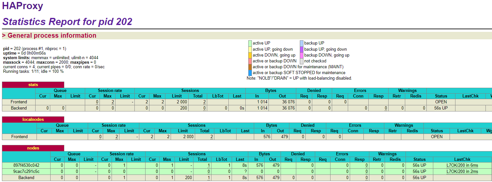
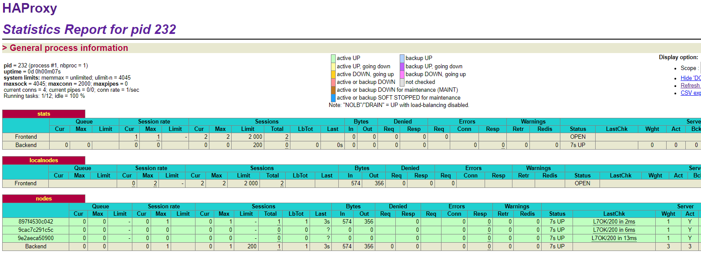
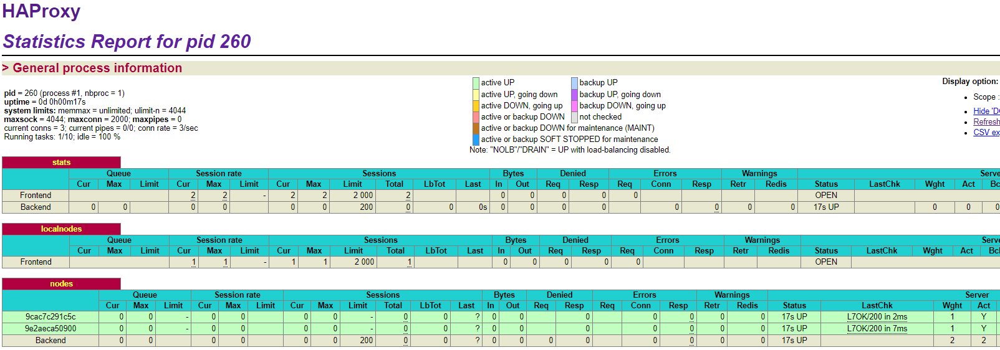

# Lab 04 - Docker

## Table of content


1. [Identify issues and install the tools](#task-0)

2. [Add a process supervisor to run several processes](#task-1)

3. [Add a tool to manage membership in the web server cluster](#task-2)

4. [React to membership changes](#task-3)

5. [Use a template engine to easily generate configuration files](#task-4)

6. [Generate a new load balancer configuration when membership changes](#task-5)

7. [Make the load balancer automatically reload the new configuration](#task-6)

8. [Difficulties]($difficulties)

9. [Conclusion]($conclusion)


## Tasks

### <a name="task-0">Task 0: Identify issues and install the tools</a>

1. <a name="M1"></a>**[M1]** Do you think we can use the current solution for a production environment? What are the main problems when deploying it in a production environment?

     *Le plus grand problème à ce moment de l'implémentation est que "rien" n'est dynamique : si on veut ajouter ou supprimer un serveur backend derrière HAProxy on doit le faire manuellement dans le fichier de config puis rebuild l'image et relancer le container. Dans un environnement de production on aimerait pouvoir plus simplement et en ayant moins voir aucun impact négatif ajouter ou supprimer des serveurs backend*

2. <a name="M2"></a>**[M2]** Describe what you need to do to add new `webapp` container to the infrastructure. Give the exact steps of what you have to do without modifiying the way the things are
   done. Hint: You probably have to modify some configuration and script files in a Docker image.

   *Pour ajouter un webapp (sx), il faut le spécifier à l'avance dans le fichier de config HAProxy (\ha\config\haproxy.cfg) dans la liste des nodes (to be in the balancing mechanism) ainsi que dans \ha\services\ha\run (sed) puis supprimer les containers, rebuild l'image de ha et enfin démarrer `ha` puis les 3 serveurs `webapp`*

3. <a name="M3"></a>**[M3]** Based on your previous answers, you have detected some issues in the current solution. Now propose a better approach at a high level.

     *Il serait préférable d'avoir une infrastructure plus dynamique qui simplifie l'ajout d'un serveur `webapp`sans avoir à manipuler de fichiers de config/scripts, par exemple que le serveur webapp s'enregistre auprès du load balancer et que ce dernier l'ajoute automatiquement à la liste des nodes*

4. <a name="M4"></a>**[M4]** You probably noticed that the list of web application nodes is hardcoded in the load balancer configuration. How can we manage the web app nodes in a more dynamic
     fashion?

     *Avec un outil permettant de gérer les membership d'un cluster. By using some eventhandler (for example webapp node joining) e.g. serf and some scripts that edit HAProxy config on the fly.*

5. <a name="M5"></a>**[M5]** In the physical or virtual machines of a typical infrastructure we tend to have not only one main process (like the web server or the load balancer) running, but a few
   additional processes on the side to perform management tasks.

   For example to monitor the distributed system as a whole it is common to collect in one centralized place all the logs produced by the different machines. Therefore we need a process running on each
   machine that will forward the logs to the central place. (We could also imagine a central tool that reaches out to each machine to gather the logs. That's a push vs. pull problem.) It is quite common to see a push mechanism used for this kind of task.

   Do you think our current solution is able to run additional management processes beside the main web server / load balancer process in a container? If no, what is missing / required to reach the goal? If yes, how to proceed to run for example a log forwarding process?

   *Il faut implémenter un outil de supervision, tel que s6. s6-overlay est particulièrement adapté car il inclut aussi les dépendances et une configuration prévue pour une utilisation avec docker*

6. <a name="M6"></a>**[M6]** In our current solution, although the load balancer configuration is changing dynamically, it doesn't follow dynamically the configuration of our distributed system when
   web servers are added or removed. If we take a closer look at the `run.sh` script, we see two calls to `sed` which will replace two lines in the `haproxy.cfg` configuration file just before we start `haproxy`. You clearly see that the configuration file has two lines and the script will replace these two lines.

   What happens if we add more web server nodes? Do you think it is really dynamic? It's far away from being a dynamic configuration. Can you propose a solution to solve this?

   *Par défaut ce n'est pas dynamique et il faut ajouter manuellement les nouveaux serveurs. En utilisant un template engine tel que NodeJS+handlebars, on peut agir dynamiquement sur le fichier de config haproxy en utilisant les données fournies par les scripts serf et en les "appliquant" sur les 'placeholders' que l'on a mis dans le template*


**Deliverables**:

1. Take a screenshot of the stats page of HAProxy at <http://192.168.42.42:1936>. You should see your backend nodes.

   

   

2. Give the URL of your repository URL in the lab report.

   https://github.com/Yannis100/Teaching-HEIGVD-AIT-2016-Labo-Docker


### <a name="task-1">Task 1: Add a process supervisor to run several processes</a>

> In this task, we will learn to install a process supervisor that will help us to solve the issue presented in the question [M5](#M5). Installing a process supervisor gives us the ability to run multiple processes at the same time in a Docker environment.

**Deliverables**:

1. Take a screenshot of the stats page of HAProxy at <http://192.168.42.42:1936>. You should see your backend nodes. It should be really similar to the screenshot of the previous task.
2. Describe your difficulties for this task and your understanding of what is happening during this task. Explain in your own words why are we installing a process supervisor. Do not hesitate to do more research and to find more articles on that topic to illustrate the problem.


### <a name="task-2">Task 2: Add a tool to manage membership in the web server cluster</a>

> Installing a cluster membership management tool will help us to solve the problem we detected in [M4](#M4). In fact, we will start to use what we put in place with the solution to issue [M5](#M5). We will build two images with our process supervisor running the cluster membership management tool `Serf`.

When we reach this point, we have a problem. If we start the HAProxy first, it will not start as the two `s1` and `s2` containers are not started and we try to link them through the Docker `run` command.

You can try and get the logs. You will see error logs where `s1` and `s2` If we start `s1` and `s2` nodes before `ha`, we will have an error from `Serf`.
They try to connect the `Serf` cluster via `ha` container which is not running.

So the reverse proxy is not working but what we can do at least is to start the containers beginning by `ha` and then backend nodes. It will make the `Serf` part working and that's what we are working on at the moment and in the next task.

Deliverables**:

1. Provide the docker log output for each of the containers: `ha`, `s1` and `s2`. You need to create a folder `logs` in your repository to store the files separately from the lab report. For each lab task create a folder and name it using the task number. No need to create a folder when there are no logs.

   Example:

   ```
   |-- root folder
     |-- logs
       |-- task 1
       |-- task 3
       |-- ...
   
   ```

2. Give the answer to the question about the existing problem with the current solution. (Anyway, in our current solution, there is kind of misconception around the way we create the `Serf` cluster. In the deliverables, describe which problem exists with the current solution based on the previous explanations and remarks. Propose a solution to solve the issue.

   When we reach this point, we have a problem. If we start the HAProxy first, it will not start as the two `s1` and `s2` containers are not started and we try to link them through the Docker `run` command.

   You can try and get the logs. You will see error logs where `s1` and `s2` If we start `s1` and `s2` nodes before `ha`, we will have an error from `Serf`.
   They try to connect the `Serf` cluster via `ha` container which is not running.

   So the reverse proxy is not working but what we can do at least is to start the containers beginning by `ha` and then backend nodes. It will make the `Serf` part working and that's what we are working on at the moment and in the next task.)

3. Give an explanation on how `Serf` is working. Read the official website to get more details about the `GOSSIP` protocol used in `Serf`. Try to find other solutions that can be used to solve similar situations where we need some auto-discovery mechanism.


### <a name="task-3">Task 3: React to membership changes</a>

> Serf is really simple to use as it lets the user write their own shell scripts to react to the cluster events. In this task we will write the first bits and pieces of the handler scripts we need to build our solution.
  We will start by just logging members that join the cluster and the members that leave the cluster. We are preparing to solve concretely the issue discovered in [M4](#M4).

**Deliverables**:

1. Provide the docker log output for each of the containers:  `ha`, `s1` and `s2`.
   Put your logs in the `logs` directory you created in the previous task.
2. Provide the logs from the `ha` container gathered directly from the `/var/log/serf.log`
   file present in the container. Put the logs in the `logs` directory in your repo.


### <a name="task-4">Task 4: Use a template engine to easily generate configuration files</a>

> We have to generate a new configuration file for the load balancer each time a web server is added or removed. There are several ways to do this. Here we choose to go the way of templates. In this task we will put in place a template engine and use it with a basic example. You will not become an expert in template engines but it will give you a taste of how to apply this technique which is often used in other contexts (like web templates, mail templates, ...).
  We will be able to solve the issue raised in [M6](#M6).

**Deliverables**:

1. You probably noticed when we added `xz-utils`, we have to rebuild the whole image which took some time. What can we do to mitigate that? Take a look at the Docker documentation on [image layers](https://docs.docker.com/engine/userguide/storagedriver/imagesandcontainers/#images-and-layers).
   Tell us about the pros and cons to merge as much as possible of the command. In other words, compare:

```
RUN command 1
RUN command 2
RUN command 3
```

  vs.

```
RUN command 1 && command 2 && command 3
```

*Il convient tout d'abord d'expliquer un peu le principe des couches (layers) de Docker. Docker utilise des pilotes de stockage (storage driver) pour gérer le contenu des couches d'image et de la "couche inscriptible" (writable container layer). Chaque pilote de stockage gère l'implémentation différemment, mais tous les pilotes utilisent des couches d'images empilables (stackable image layers) et la stratégie Copy-on-write (CoW).*

*Copy-on-write est une stratégie de partage et de copie de fichiers pour une efficacité maximale. Si un fichier ou un répertoire existe dans un calque (layer) inférieur de l'image, et qu'un autre calque (y compris le calque inscriptible) doit y accéder en lecture, il utilise simplement le fichier existant. La première fois qu'un autre calque doit modifier le fichier (lors de la construction de l'image ou de l'exécution du conteneur), le fichier est copié dans ce calque et modifié. Ceci minimise les E/S et la taille de chacune des couches suivantes.*
*Le partage favorise les images plus petites. Lorsque vous utilisez docker pull pour extraire une image d'un référentiel, ou lorsque vous créez un conteneur à partir d'une image qui n'existe pas encore localement, chaque calque est extrait séparément et stocké dans la zone de stockage local de Docker, qui est généralement /var/lib/docker/ sur des hôtes Linux.*
*Chacune de ces couches est stockée dans son propre répertoire dans la zone de stockage local de l'hôte Docker. Pour examiner les couches du système de fichiers, listez le contenu de /var/lib/docker/<storage-driver>/layers/*

*Lorsque vous démarrez un conteneur, une fine couche de conteneur inscriptible est ajoutée au-dessus des autres couches. Toutes les modifications que le conteneur apporte au système de fichiers sont stockées ici. Tous les fichiers que le conteneur ne change pas ne sont pas copiés dans ce calque inscriptible. Cela signifie que la couche inscriptible est aussi petite que possible.*
*Lorsqu'un fichier existant dans un conteneur est modifié, le pilote de stockage effectue une opération de copie sur écriture (CoW). Les étapes spécifiques impliquées dépendent du pilote de stockage spécifique.*
*Remarque : pour les applications nécessitant beaucoup d'écriture, vous ne devriez pas stocker les données dans le conteneur. Utilisez plutôt des volumes Docker, qui sont indépendants du conteneur et sont conçus pour être efficaces pour les E/S. De plus, les volumes peuvent être partagés entre les conteneurs et n'augmentent pas la taille de la couche inscriptible de votre conteneur.*
*Une opération copy_up peut entraîner un impact sur les performances notable. Cette surcharge varie en fonction du pilote de stockage utilisé. De gros fichiers, beaucoup de calques et des arborescences de répertoires profondes peuvent rendre l'impact plus perceptible. Ceci est atténué par le fait que chaque opération copy_up ne se produit que la première fois qu'un fichier donné est modifié.*

*Le storage driver recommandé pour toute version de Linux le supportant est `overlay2`* 

```
vagrant@ubuntu-14:/vagrant$ docker ps -s
CONTAINER ID        IMAGE                      NAMES       SIZE
2e29a5f396fc        softengheigvd/ha           ha          12.4kB (virtual 233MB)
4e00f92ae606        softengheigvd/webapp       s2          5.25kB (virtual 701MB)
4da3fb4b9f2c        softengheigvd/webapp       s1          5.25kB (virtual 701MB)
```

```
vagrant@ubuntu-14:/vagrant$ docker history softengheigvd/ha
IMAGE               CREATED             CREATED BY                                      SIZE
cb31de375dce        44 minutes ago      /bin/sh -c #(nop)  ENTRYPOINT ["/init"]         0B
8ca173508624        44 minutes ago      /bin/sh -c mkdir /config                        0B
6fb4c5946451        44 minutes ago      /bin/sh -c #(nop) COPY file:25b08436f35f65a9…   427B   
cf780dcdd317        2 weeks ago         /bin/sh -c mkdir /serf-handlers                 0B
750233b6f472        2 weeks ago         /bin/sh -c curl -sSLo /tmp/node.tar.xz https…   37.1MB
be484d9b7010        2 weeks ago         /bin/sh -c apt-get update && apt-get -y inst…   111MB
094e39a5cb39        3 weeks ago         /bin/sh -c #(nop)  MAINTAINER Yannis Ansermo…   0B
```

```
vagrant@ubuntu-14:/vagrant$ docker image ls
REPOSITORY             TAG                 IMAGE ID            CREATED             SIZE
softengheigvd/ha       latest              cb31de375dce        About an hour ago   233MB
```

```
vagrant@ubuntu-14:/vagrant$ docker info
Server Version: 18.06.1-ce
Storage Driver: aufs
 Root Dir: /var/lib/docker/aufs
 Backing Filesystem: extfs
 Dirs: 122
 Dirperm1 Supported: false
Logging Driver: json-file
```

*Pour en revenir à la question de la différence entre les 3 RUN séparés ligne par ligne et ceux en une ligne avec des && : dans le premier cas 3 nouvelles couches (layers) seront crées (cf docker history au dessus) tandis que dans le cas des &&, une seule couche (plus grande) sera créé*
*De plus, dans le cas spécifique des commandes `apt-get update` et `apt-get install` il est nécessaire de les lancer en 1 seul RUN statement car dans le cas contraire si on ajout un install l'utilisation du cache pour reconstruire l'image décidera que seul le install a changé et non le update et de ce fait ne rebuildera pas la couche du update et l'on risque ainsi de se retrouver avec des versions obsolètes.*
*Dans le cas de commandes COPY, il est préférable de copier les fichiers individuellement, plutôt que tous à la fois. Ceci garantit que le cache de compilation de chaque étape n'est invalidé (forçant l'étape à être réexécutée) que si les fichiers spécifiquement requis changent. De plus COPY est nettement préféré à ADD (dû à des fonctionnalités de ADD rarement exploitées telle que tar auto-extraction)*

There are also some articles about techniques to reduce the image size. Try to find them. They are talking about `squashing` or `flattening` images.

https://docs.docker.com/develop/develop-images/dockerfile_best-practices/
https://www.codacy.com/blog/five-ways-to-slim-your-docker-images/
https://medium.com/@chamilad/docker-image-size-concerns-out-of-the-window-squash-with-confidence-796f7c48f5c6
https://ypereirareis.github.io/blog/2016/02/15/docker-image-size-optimization/
https://stackoverflow.com/questions/41764336/how-does-the-new-docker-squash-work

*Le fait d'inclure par inadvertance des fichiers qui ne sont pas nécessaires à la construction d'une image entraîne un contexte de construction et une taille d'image plus grands. Cela peut augmenter le temps de construction de l'image, le temps de la tirer (pull) et de la pousser, et la taille d'exécution du conteneur.*

*Les builds multi-étapes (multi-stage builds, plusieurs FROM dans un Dockerfile) vous permettent de réduire considérablement la taille de votre image finale, sans avoir à lutter pour réduire le nombre de couches et de fichiers intermédiaires.*
*Parce qu'une image est construite au cours de l'étape finale du processus de construction, vous pouvez minimiser les couches d'image en utilisant le cache de construction.*
*Par exemple, si votre build contient plusieurs couches, vous pouvez les classer par ordre décroissant de la moins fréquemment modifiée (pour vous assurer que le cache de build est réutilisable) à la plus fréquemment modifiée*

*Parce que la taille de l'image est importante, il est fortement déconseillé d'utiliser ADD pour récupérer des paquets à partir d'URL distantes ; vous devriez plutôt utiliser curl ou wget. De cette façon, vous pouvez supprimer les fichiers dont vous n'avez plus besoin une fois qu'ils ont été extraits et vous n'avez pas à ajouter un autre calque/couche dans votre image.*

*Squash*
*Une fois la compilation terminée, Docker crée une nouvelle image en chargeant les différences de chaque calque dans un seul nouveau calque et référence tous les calques du parent.*
*En d'autres termes : lors de l'écrasement, Docker prendra toutes les couches du système de fichiers produites par une compilation et les réduira en une seule nouvelle couche.*
*Cela peut simplifier le processus de création d'images de conteneurs minimales, mais peut entraîner des frais généraux légèrement plus élevés lorsque les images sont déplacées (car les couches écrasées ne peuvent plus être partagées entre les images). Docker met toujours en cache les couches individuelles pour accélérer les constructions suivantes.*
*Veuillez noter que cette fonction écrase toutes les couches nouvellement construites en une seule couche, ce n'est pas un écrasement "to scratch".*

*A partir de Docker 1.13 prend également en charge la compression du contexte de compilation qui est envoyé depuis CLI vers le démon à l'aide de l'option --compress. Cela accélérera les builds effectuées sur des démons distants en réduisant la quantité de données envoyées.*

*Flatten*
*Pour se faire il suffit d'exporter le container (`docker export <container ID>` et non `docker save`)*
*Ainsi, si nous exportons un conteneur (soit un conteneur déjà en cours d'exécution, soit un nouveau conteneur à partir d'une image), il perdra son historique et tous les calques précédents. Cela rendra impossible le retour en arrière d'un calque donné, mais cela réduira également l'image.* 
*En 1 commande : `docker export <CONTAINER ID> | docker import - some-image-name:latest`*


2. Propose a different approach to architecture our images to be able to reuse as much as possible what we have done. Your proposition should also try to avoid as much as possible repetitions between
   your images.

   [ToDo]

3. Provide the `/tmp/haproxy.cfg` file generated in the `ha` container after each step.  Place the output into the `logs` folder like you already did for the Docker logs in the previous tasks. Three files are expected.

   *A noter que les IPs on changés d'une semaine à l'autre et certains output sont d'une semaine et certains de la suivante*

   In addition, provide a log file containing the output of the `docker ps` console and another file (per container) with`docker inspect <container>`. Four files are expected.

4. Based on the three output files you have collected, what can you say about the way we generate it? What is the problem if any?

   *Pour l'instant, le fichier `/tmp/haproxy.cfg`est réécrit à chaque fois que le script member-join est appelé, on n'a pas d'historique, la ligne dans le fichier n'est pas ajoutées mais remplacée.*


### <a name="task-5">Task 5: Generate a new load balancer configuration when membership changes</a>

> We now have S6 and Serf ready in our HAProxy image. We have member join/leave handler scripts and we have the handlebars template engine. So we have all the pieces ready to generate the HAProxy configuration dynamically. We will update our handler scripts to manage the list of nodes and to generate the HAProxy configuration each time the cluster has a member leave/join event.
  The work in this task will let us solve the problem mentioned in [M4](#M4).

**Deliverables**:

1. Provide the file `/usr/local/etc/haproxy/haproxy.cfg` generated in the `ha` container after each step. Three files are expected.

   In addition, provide a log file containing the output of the `docker ps` console and another file (per container) with `docker inspect <container>`. Four files are expected.

2. Provide the list of files from the `/nodes` folder inside the `ha` container.
   One file expected with the command output.

3. Provide the configuration file after you stopped one container and the list of nodes present in the `/nodes` folder. One file expected with the command output. Two files are expected.

    In addition, provide a log file containing the output of the `docker ps` console. One file expected.

    *Lors de la manipulation pour stopper s2, je me suis planté et j'ai aussi supprimé les containers ha et s1, de ce fait les id ne sont pas les même que pour les questions 1-2 de cette task*

4. (Optional:) Propose a different approach to manage the list of backend nodes. You do not need to implement it. You can also propose your own tools or the ones you discovered online. In that case, do not forget to cite your references.


### <a name="task-6">Task 6: Make the load balancer automatically reload the new configuration</a>

> Finally, we have all the pieces in place to finish our solution. HAProxy will be reconfigured automatically when web app nodes are leaving/joining the cluster. We will solve the problems you have discussed in [M1 - 3](#M1).
  Again, the solution built in this lab is only one example of tools and techniques we can use to solve this kind of situation. There are several other ways.

**Deliverables**:

1. Take a screenshots of the HAProxy stat page showing more than 2 web applications running. Additional screenshots are welcome to see a sequence of experimentations like shutting down a node and starting more nodes.

   

   S1+S2

   Start S3

   

   S1+S2+S3

   Shutdown S1

   

   S2+S3

   Also provide the output of `docker ps` in a log file. At least one file is expected. You can provide one output per step of your experimentation according to your screenshots.

2. Give your own feelings about the final solution. Propose improvements or ways to do the things differently. If any, provide references to your readings for the improvements.

   *Use updated version of the tools*

   *Consul* [HAProxy with consul](https://www.hashicorp.com/blog/haproxy-with-consul)

   *HAProxy restart with _zero_ downtime* [Zero downtime with HAProxy article](http://engineeringblog.yelp.com/2015/04/true-zero-downtime-haproxy-reloads.html)

3. (Optional:) Present a live demo where you add and remove a backend container.


## <a name="difficulties">Difficulties</a>

Task 2 :

Pleins de soucis et différentes tentatives de modifier le fichier haproxy.cfg car les nodes backends apparaissent down dans l'interface web haproxy.

Les nodes backend se "présentent" au cluster serf avec le nom de container et non s1 et s2, de plus suite à la création du network spécifique, s1 et s2 ne sont pas résolus dans /etc/hosts tandis qu'avec le network par défaut (bridge) et les paramètres `--link` de la commande run de ha on les retrouve dans le fichier hosts, dans le cas où l'on spécifie notre network crée, les paramètres --link ne semblent n'avoir aucun effet.

Néanmoins on constate que dans le réseau par défaut 'bridge', le nameserver est hérité de virtualbox (/etc/resolv.conf 10.0.2.3) et sans les --link les container n'arriveront pas à se résoudre parmis. Avec notre network 'heig', le nameserver est 127.0.0.11 et résoud bien s1, s2 et ha ainsi que les noms des containers respectifs.

Finalement nous avons entré l'IP en statique dans haproxy.cfg

Task 3 : 

Après la configuration du dockerfile pour copier le run de serf, les fichiers sont bien copiés et au bon endroit, néanmoins des erreurs :

```bash
: No such file or directory bash
```

C'était dû aux retours à la ligne au format windows et cela empechait serf de démarrer, il a suffit convertir les sauts de ligne en format Unix

## <a name="conclusion">Conclusion</a>


